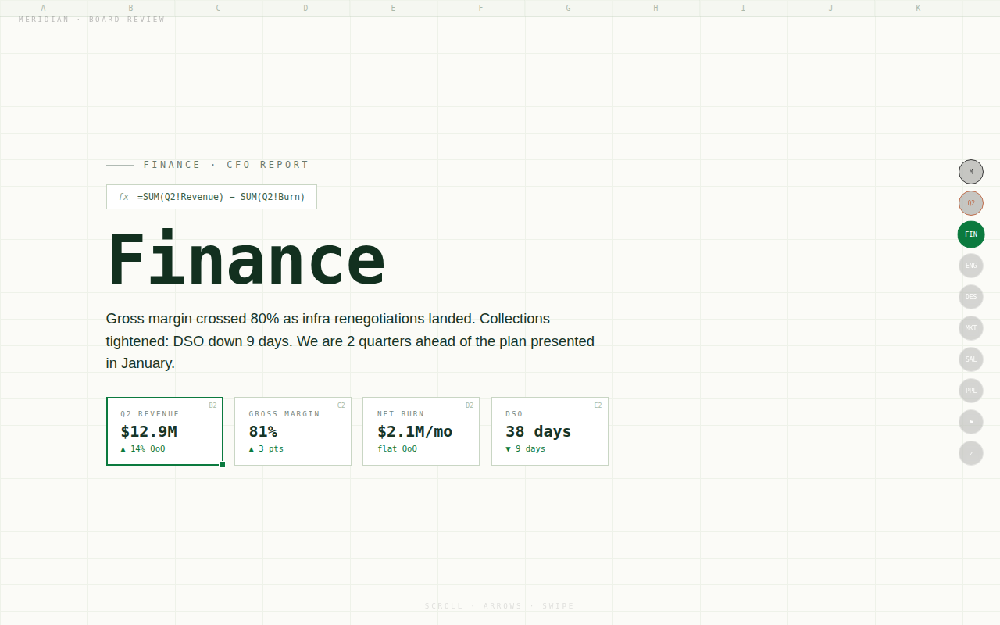
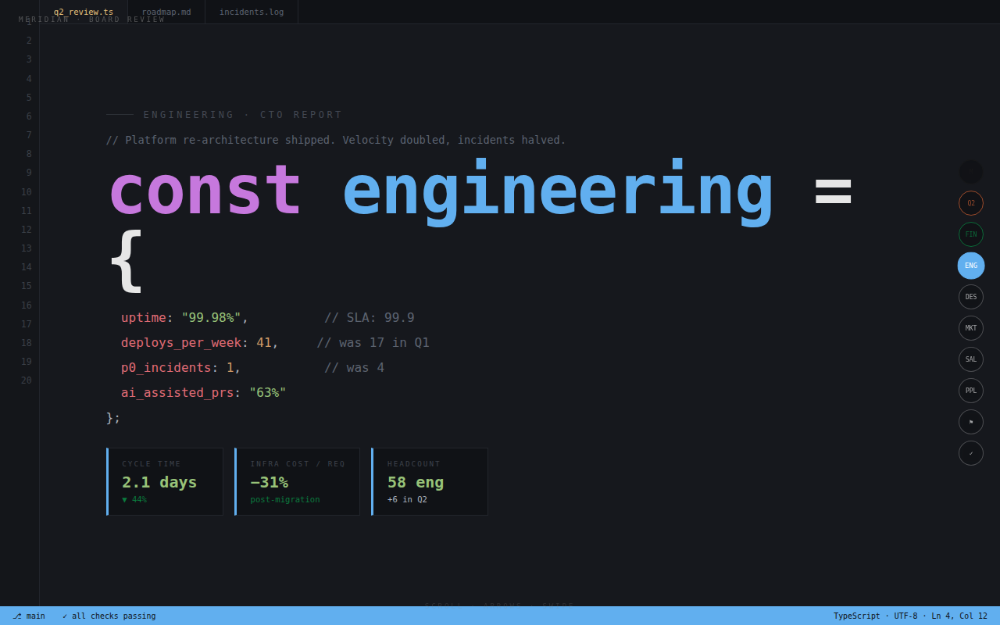
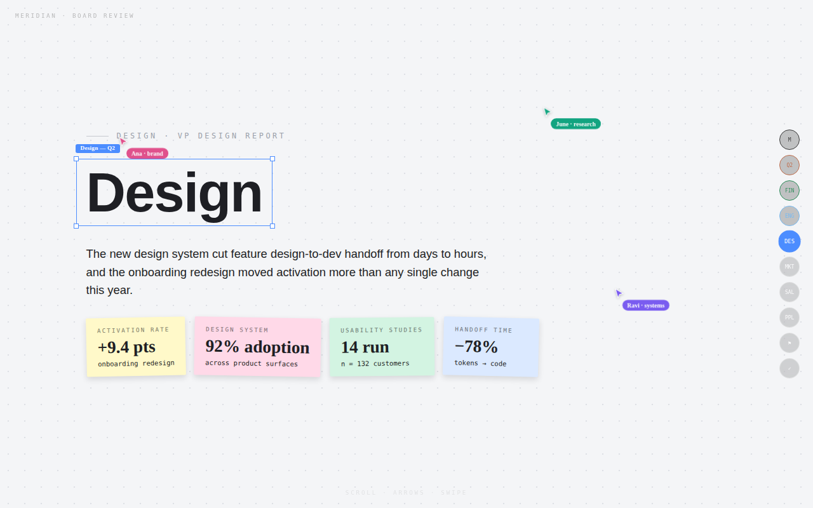
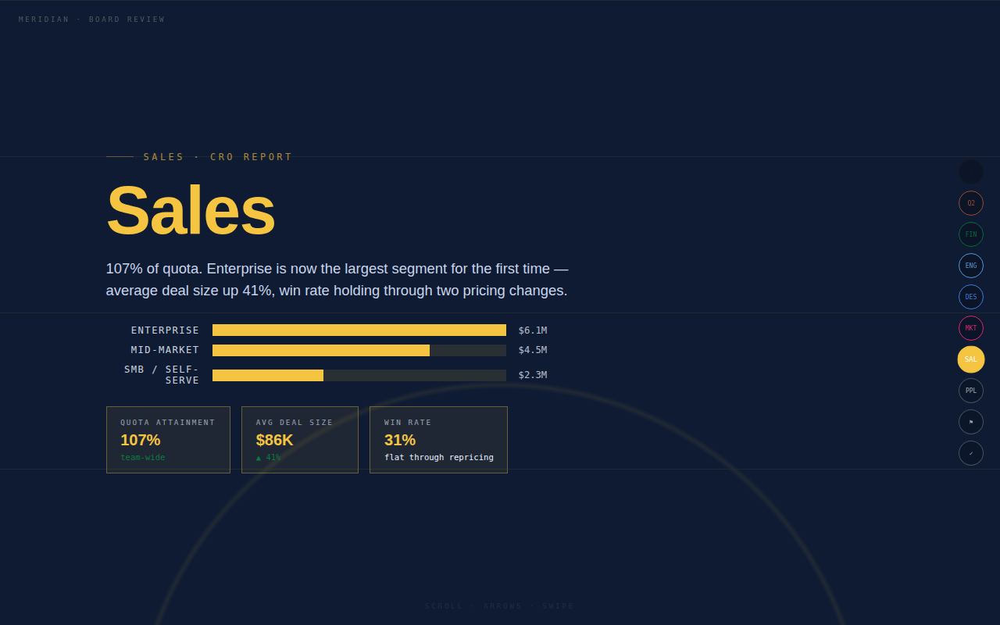
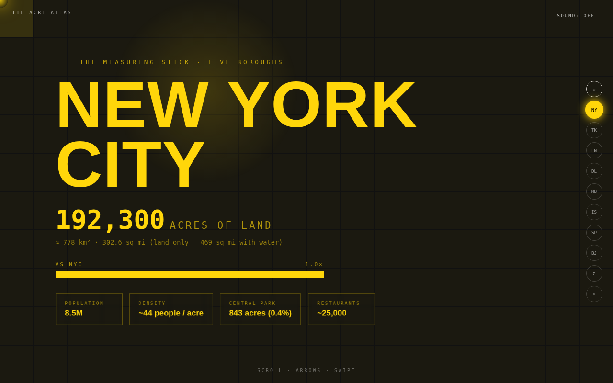
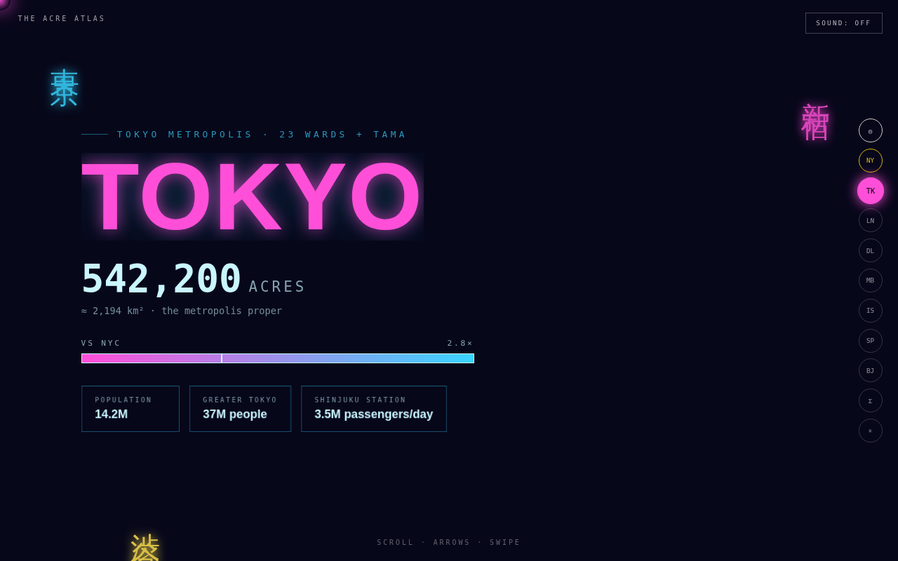
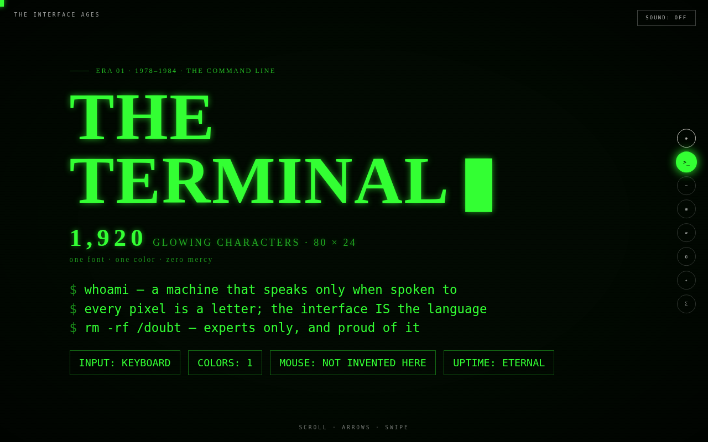
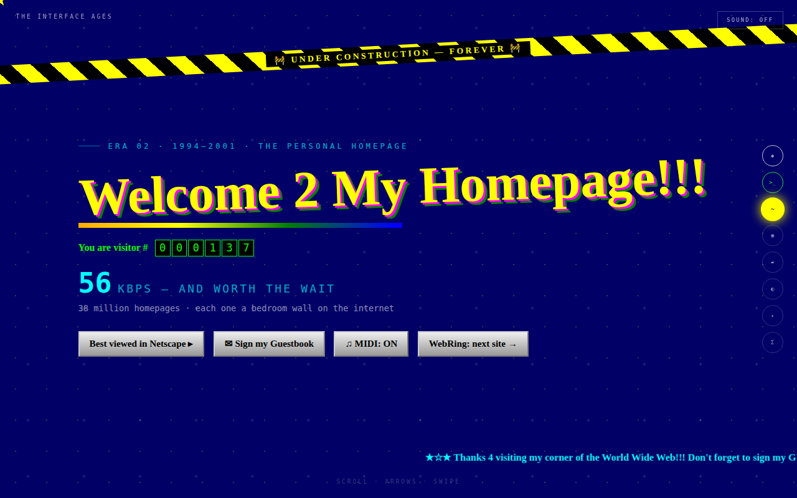
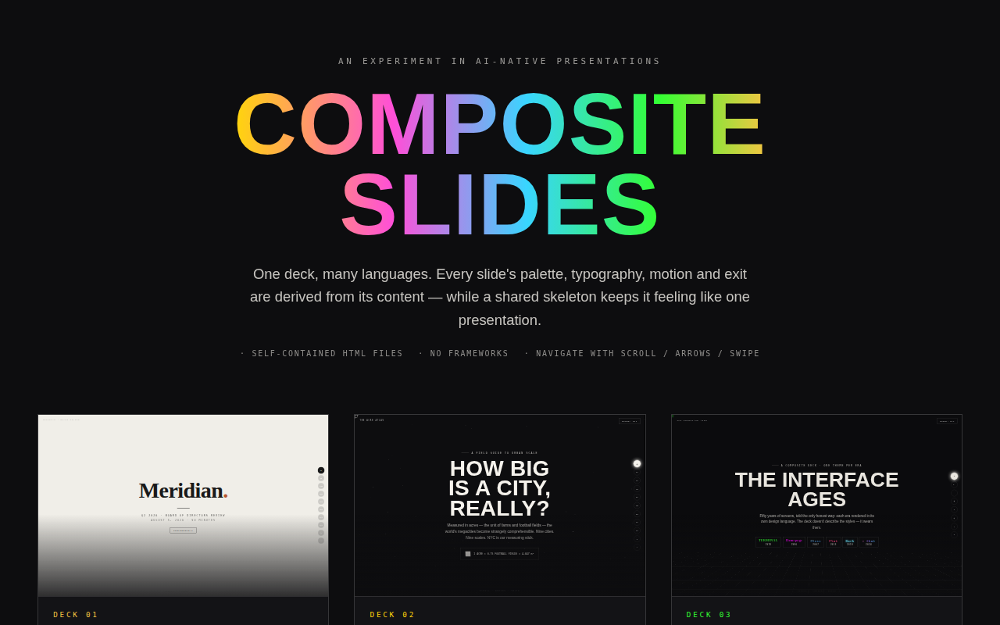

<div align="center">

# 🎭 Composite Slides

**Presentations where every slide speaks its own visual language.**

Palette, typography, motion, sound — even the exit transition — change with the content,
while a shared skeleton keeps it feeling like *one* deck.

Every deck is a **single self-contained HTML file**. No frameworks. No build step. Open it and present.

[The decks](#the-decks) · [Why](#why-composite) · [Run it](#run-it) · [The recipe](#the-recipe) · [Make your own](#make-your-own)

</div>

---

## Why composite?

Presentations have always had *one* theme, for one reason: themes were expensive. A designer had to hand-build each one, so everyone standardized on a single template.

AI collapsed the cost of a theme to nearly zero. That flips the question from *"can we afford multiple themes?"* to *"where does a theme carry meaning?"* — and it turns out the answer is: surprisingly often. When the finance slide looks like a ledger and the engineering slide looks like an IDE, the styling isn't decoration. It's information.

## The decks

### 01 · The Board Deck — the serious demo

**[`decks/board-meeting.html`](decks/board-meeting.html)** — a fictional Q2 board review where each department presents in its native language. You always know whose numbers you're looking at.

| Finance presents as a ledger | Engineering presents as an IDE |
|---|---|
|  |  |

| Design presents as a live canvas | Sales presents as a leaderboard |
|---|---|
|  |  |

Marketing gets the campaign gradient, People gets warmth and serifs, and Risks & Asks is a stark, undecorated memo — because seriousness is a theme too. The deck opens and closes in neutral executive ivory, so the theme shifts read as chapters, not chaos.

### 02 · The Acre Atlas

**[`decks/acre-atlas.html`](decks/acre-atlas.html)** — how big are the world's cities, measured in acres? Nine cities, nine visual dialects: taxi-grid NYC, neon Tokyo, fog-bound London, marigold Delhi, a monsoon Mumbai that literally floods into the next slide.

| | |
|---|---|
|  |  |

### 03 · The Interface Ages

**[`decks/interface-ages.html`](decks/interface-ages.html)** — fifty years of UI design, each era rendered in itself: terminal phosphor, Geocities chaos, skeuomorphic gloss, flat material, dark mode, the AI chat era. The deck doesn't describe the styles — it wears them.

| | |
|---|---|
|  |  |

## Run it

**Zero-install** — every deck is one portable HTML file:

```bash
# just open any deck in a browser
open decks/board-meeting.html
```

**Or run the gallery** (a tiny Vite app with live previews of all decks):

```bash
npm install
npm run dev
```



Navigate any deck with **scroll, arrow keys, or swipe**. The art decks also have per-slide ambient sound (WebAudio, no audio files — hit `SOUND: ON`).

## The recipe

Five ingredients make a deck *composite* instead of just "many themes":

1. **A shared skeleton.** One navigation system, one layout grammar (eyebrow → title → big stat → detail chips), one progress rail. This is what keeps ten themes feeling like one deck.
2. **A per-slide language.** Background, palette, display type, and an *ambient system* (rain, neon flicker, spreadsheet grid, IDE line numbers) derived from the content.
3. **Signature exits.** Each slide leaves the way its subject would: the terminal powers off like a CRT, the spreadsheet clears column by column, the neon suffers a power cut.
4. **Breach moments.** Occasionally one slide's world leaks into the next — Mumbai's monsoon rains onto the following city; the Geocities marquee keeps scrolling over the glossy Web 2.0 era. Used sparingly, this is what makes the deck feel alive.
5. **Theme-aware chrome.** The progress dots, cursor, and sound switch with each slide, so even the deck's furniture is in on it.

And one rule of restraint: **a constant measuring stick** (acres vs NYC, quarterly deltas, one KPI grammar) carried across every theme — so the deck stays one argument, not an anthology.

## When to actually use this

- **Board & department reviews** — each team in its native tooling aesthetic (this repo's demo)
- **Agency portfolios & pitches** — each case study in that client's brand
- **Competitive landscapes** — each competitor slide in *their* visual language
- **Sales decks** — current-state slides styled as the clunky legacy tool, future-state in your brand; the contrast does the persuading
- **Teaching** — distinct visual worlds per concept are memory anchors (the von Restorff effect)
- **Keynotes** — a theme shift at each chapter is a built-in attention reset

Ten more fully-specified deck concepts (with signature exits and breach moments) live in **[EXAMPLES.md](EXAMPLES.md)**, along with a litmus test for which topics deserve the treatment.

## Make your own

Composite decks are AI-native by design — hand one of the decks in `decks/` to your favorite coding assistant along with the recipe above and a prompt like:

> Build a composite slide deck about `<your topic>` as a single self-contained HTML file.
> Keep a shared skeleton (scroll/arrow/swipe navigation, a themed progress rail, a consistent
> layout grammar), but give every slide its own visual language derived from its content —
> palette, typography, ambient animation, and a signature exit transition. Add one "breach"
> moment where a slide's world leaks into the next. End with a finale slide in a neutral
> style that lines all the themes up side by side.

PRs with new decks are very welcome — add a single HTML file to `decks/`, register it in `src/main.js`, and open a PR.

## License

[MIT](LICENSE)
